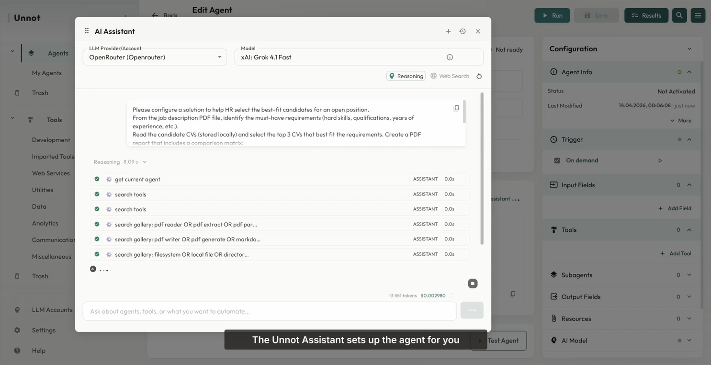
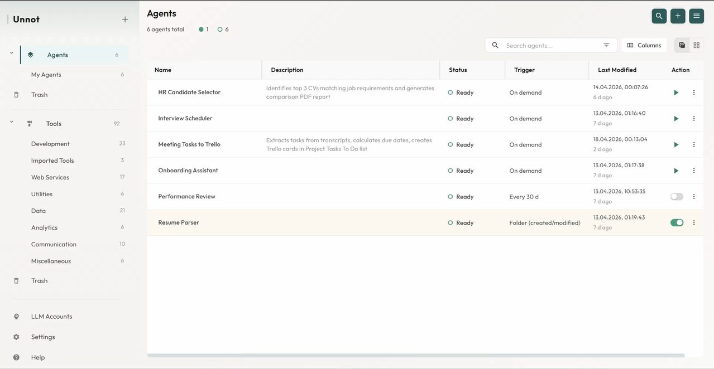
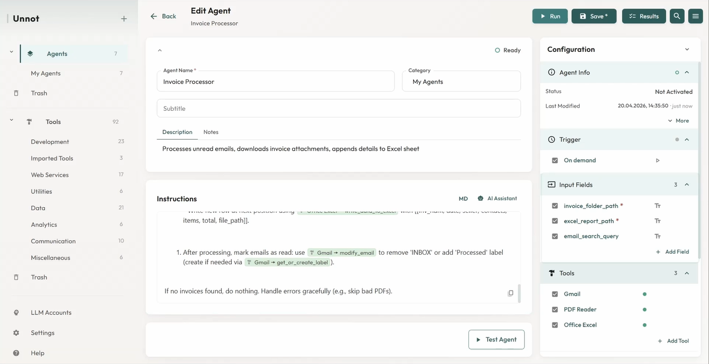
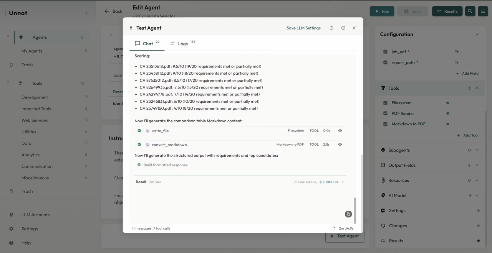

  

# Unnot

Unnot is a local desktop AI assistant for turning everyday work tasks into reusable automations.

Describe what you want to automate, connect the tools it needs, run the workflow locally, and keep it for next time.

  <a href="https://unnot.app"><strong>Website</strong></a> ·
  <a href="https://unnot.app/#early-access"><strong>Download Early Access</strong></a> ·
  <a href="https://unnot.app/mcp-servers"><strong>MCP Gallery</strong></a> ·
  <a href="https://unnot.app/#use-cases"><strong>Demos</strong></a>

## What Unnot Helps With

- Process invoice emails into structured spreadsheet rows.
- Turn meeting transcripts into Trello tasks.
- Analyze spreadsheets, CSV files, and documents.
- Build scheduled reports, digests, and monitoring workflows.
- Connect local files, LLM providers, and MCP tools.

## How It Works

Unnot is currently a desktop agent builder with an AI Assistant on top. You can describe a workflow in plain language, let the assistant configure the agent, review every setting, and run it locally with your own tools and credentials.

The product direction is task-first: start from the job you need done, then let Unnot assemble the repeatable workflow behind it.

**Reusable agents can be launched on demand or by triggers.**

  

## Demos

**Invoice processing agent configured with input fields and tools.**

  

**Execution view with tool calls, logs, and generated results.**

  

Current public examples:

- Invoice processing from email attachments to spreadsheet records.
- Meeting transcripts converted into structured Trello tasks.
- Local AI workflows with files, tools, schedules, logs, and result history.

Watch the demos on [unnot.app](https://unnot.app).

## Public Repositories

- [`unnot-mcp-gallery`](https://github.com/unnot-lab/unnot-mcp-gallery) — curated public MCP server metadata used by Unnot.
- [`unnot-web-content`](https://github.com/unnot-lab/unnot-web-content) — generated runtime content bundle for the Unnot website.

The main desktop application is currently proprietary. Public repositories focus on integration metadata, documentation content, and ecosystem resources.

## Contributing

The best place to contribute today is the MCP Gallery: add or improve public MCP server metadata, icons, descriptions, and setup hints.

Start here: [`unnot-mcp-gallery`](https://github.com/unnot-lab/unnot-mcp-gallery)

## Contact

Website: [unnot.app](https://unnot.app)  
Email: support@unnot.app